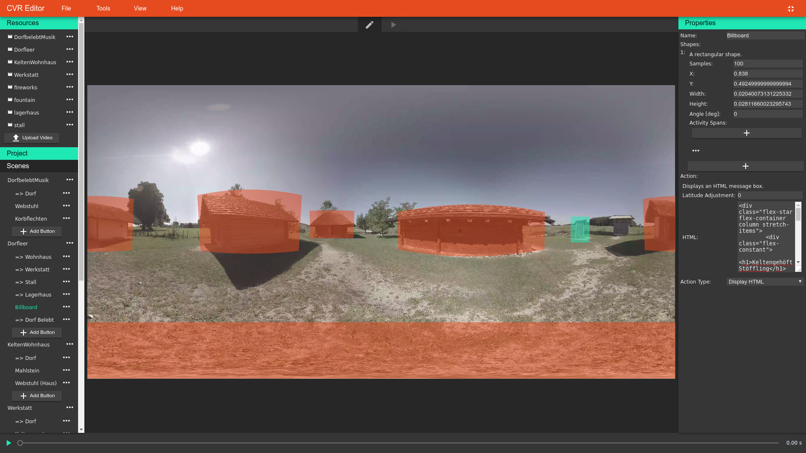

# CVR Editor

This application can be used to create interactive cinematic virtual reality experiences. It was created to test different affordances for the interactivity of buttons.



# Requirements

- [Node.js](https://nodejs.org/) >= v9
- [Chrome](https://www.google.com/chrome/)/[Chromium](https://www.chromium.org/) >= v63 - Other browsers that support WebVR may work as well.

# Installation

Using [Yarn](https://yarnpkg.com/) to install the dependencies is recommended. You can install Yarn globally for use anywhere using NPM (included in Node):

```shell
npm install -g yarn
```

(Make sure your environment variables are set up correctly to include your global package binary directory.)

Then simply run Yarn in the root directory.

```shell
yarn
```

After half the universe has been downloaded, the install script will automatically be run. This compiles the server and client parts using [Webpack](https://webpack.js.org/).

The application server then can be started using the command:

```shell
npm run start
```

Or to choose a custom port, e.g. `1234`:

```shell
npm run start -- 1234
```

This will also print the `localhost` URL for the application.

## Enabling WebVR

When using a Chrome browser, you may need to toggle a development flag to enable WebVR; you can check the [*Can I use* chart](https://caniuse.com/#feat=webvr) to see whether this is the case. This flag can be found using this URL: [chrome://flags/#enable-webvr](chrome://flags/#enable-webvr)


# Known Issues

- The algorithm for mapping the corners of rectangular button shapes is wrong. They can still be used but do not scale the way they should.
- The *Halos* affordance has some bugs, as it was deemed too hard to interpret and too visually noisy to invest in any further.
- Almost no tests at all.